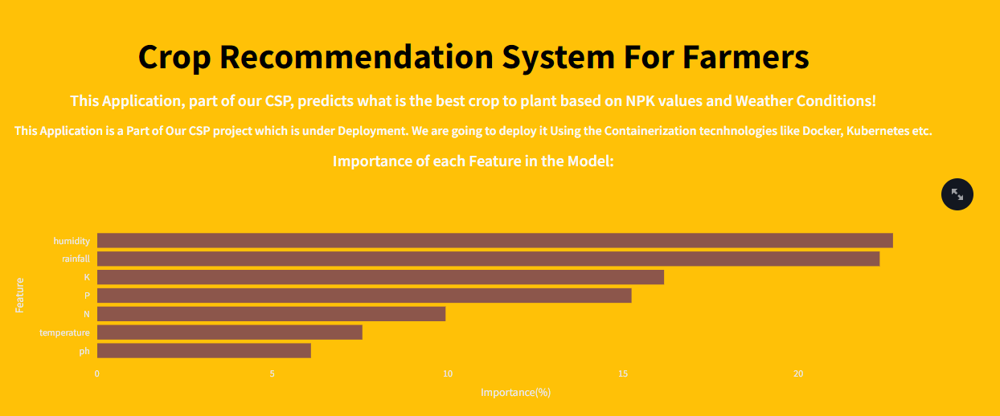

# Crop Recommendation System

This Application recommends the best crop to plant based on Soil and Weather conditions!


## Crop recommendation system models

All the models that were created and tested to be used on this application are in the [models.ipynb](https://github.com/MPrevelato/Crop_Recommendation_System/blob/main/models.ipynb)

For the requirements you can access the [requirements.txt](https://github.com/MPrevelato/Crop_Recommendation_System/blob/main/requirements.txt)
# Web Interface

## Streamlit

The Web App was made on Streamlit, you can see the code on the [app.py](https://github.com/MPrevelato/Crop_Recommendation_System/blob/main/app.py),you can use use it and edit offline on your machine by installing the requirements.txt and by running this code in the Terminal:

```
streamlit run app.py
```
